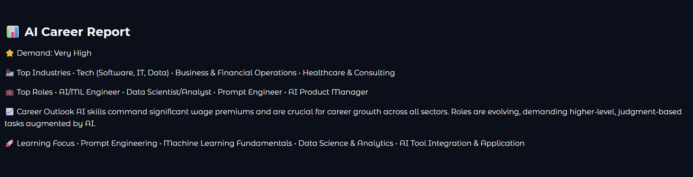

# 🚀 SkillMap AI

An AI-powered career guidance platform that provides personalized career insights, industry demand analysis, and live job opportunities using Generative AI and real-time job APIs.

---

## ✨ Features

- 🤖 AI-generated personalized career reports
- 📈 Industry demand analysis
- 💼 Live job listings
- 🌍 Location-based job search
- 🧠 Google Gemini powered recommendations
- 🔍 Real-time industry research using Tavily
- ⚡ Fast and responsive Gradio interface

---

## 📷 Screenshots

### Home Page


### AI Career Report



### Live Jobs


---

## 🛠 Tech Stack

- Python
- Gradio
- Google Gemini 2.5 Flash
- LangChain
- Tavily Search API
- Active Jobs DB API (RapidAPI)
- Requests
- Python Dotenv

---

## 📂 Project Structure

```
SkillMapAI/
│
├── app.py
├── config.py
├── industry.py
├── job_search.py
├── report_generator.py
├── styles.css
├── requirements.txt
├── README.md
├── .env.example
├── assets/
```

---

## ⚙ Installation

Clone the repository

```bash
git clone https://github.com/YOUR_USERNAME/SkillMapAI.git
```

Go into the project

```bash
cd SkillMapAI
```

Create a virtual environment

```bash
python -m venv venv
```

Activate it

Windows

```bash
venv\Scripts\activate
```

Install dependencies

```bash
pip install -r requirements.txt
```

---

## 🔑 Environment Variables

Create a `.env` file.

```env
GOOGLE_API_KEY=your_google_api_key
TAVILY_API_KEY=your_tavily_api_key
RAPID_API_KEY=your_rapidapi_key
```

---

## ▶ Running the Project

```bash
python app.py
```

The application will start on

```
http://127.0.0.1:7860
```

---

## 🎯 Future Improvements

- Resume Analyzer
- Skill Gap Detection
- Learning Roadmap Generator
- Salary Prediction
- PDF Career Report
- User Authentication
- Parallel API Calls
- Better Loading Animation

---

## 👨‍💻 Author

**Buvashid Chavan**

Electronics & Telecommunication Engineering

AI | Full Stack Development | Generative AI

---

## ⭐ Support

If you like this project, consider giving it a ⭐ on GitHub.
